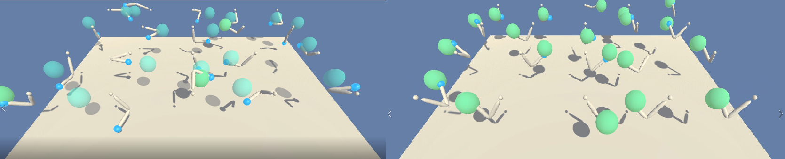

 [//]: # (Image References)  
  
[image1]: https://user-images.githubusercontent.com/10624937/42135619-d90f2f28-7d12-11e8-8823-82b970a54d7e.gif "Trained Agent"  
  
# UDACITY REINFORCED LEARNING NANODEGREE: Project 2 Continuous Control  

  
### 0. Project Details  
  
 This project is part of the RL learning nanodegree from UDACITY. In this project we build an Agent able to control an arm to reach a mobile sphere. This is a continuous control task where the agent is rewarded for keeping in contact with the sphere at each time step. The agent does not collect a reward if it loses the contact. 
 The Agent will evolve in an environment built using [Unity](https://blogs.unity3d.com/2017/09/19/introducing-unity-machine-learning-agents/) 

 Two different environments are provided. The first one contains only one agent while the second allows the training of 20 different agents. 
  
#### The Environment  
  
We train an agent to control an arm.  The agent's goal is to provide controls on each of the arm joints to keep in contact with a target sphere moving around a central point.  
In this environment, a double-jointed arm can move to target locations. A reward of +0.1 is provided for each step that the agent's hand is in the goal location. Thus, the goal of your agent is to maintain its position at the target location for as many time steps as possible.
 
##### Environment Observation space  
The observation space consists of 33 variables corresponding to position, rotation, velocity, and angular velocities of the arm.

##### Action space  
To control the arm, four ontinuous actions are available.
Each action is a vector with four numbers, corresponding to torque applicable to two joints. Every entry in the action vector should be a number between -1 and 1.
  
##### Reward mechanism  
Reward is given at each time step where the hand of the arm is in contact with the target sphere. 
If visualising the environment, the sphere is semi transparent when the agent is not reaching it.

##### Criteria for solving the environment  
The task is continuous, and in order to solve the environment, the agent must get an average score of +30 over 100 consecutive episodes.  
One episode is 1000 time step long.

### 1. Getting Started  
  
#### Preamble  

This project was developed on a **Windows 64 bits** platform using **CPU** computation.

To launch the project you will require installing Unity environment and its dependencies. The Windows installation is covered [here](https://github.com/Unity-Technologies/ml-agents/blob/master/docs/Installation-Windows.md)

#### Installing

As suggested in the Unity walkthrough, it is recommended creating a new *conda*  environment. Below are some additional recommendations where we used "p1_navigation" as the name for our environment:

* Download this project and decompress it in a local folder (e.g: p2_continous_control)
* Open the command windows (cmd) and select the project folder as your current directory (cd "path")
* After executing the following steps from the procedure
 `conda env create -n p2_continous_control`
 `activate p2_continous_control`
 `pip install tensorflow==1.7.1`
 Install the git package to clone the ml-agent repository
 `conda install git`
Clone the ml-agent git repository
 `git clone https://github.com/Unity-Technologies/ml-agents.git`
* Go into the ml-agents python folder and perform the installation: 
 `cd ml-agents\python`  
 `pip install .`  
 
#### Adding Pytorch
This project uses the Pytorch library and you will need to install it. Instructions can be found [here](https://pytorch.org/)
 With your environment activated enter following commands:
`conda install pytorch-cpu -c pytorch`
`pip3 install torchvision`

#### Environment Runtime
For the project to run you will require the Windows version of the Continous Control runtime. This has been provided in the project folder and just need to be uncompressed in the same folder `./Reacher_Windows_x86_64/`or `./Reacher_windows_x86_64_20/`

#### Base files for deep learning
During the Udacity lectures the DDPG algorithm was introduced and covered the implementation made by [Shangtong Zhang](https://github.com/ShangtongZhang). This agent used in this project is based on the code published on Shangtong's repository. 

### Run the project  
 
#### Structure

 The project folder contains two differents Jupyter notebooks:  
1. ContinuousControl_1agent : Notebook containing the implementation done for environment training one agent 
2. ContinuousControl_20agents : Notebook containing the implementation done for environment training 20 agents in parallel 

#### Execution

Launch the jupyter notebook
`jupyter notebook ContinuousControl_1agent.ipynb`
or
`jupyter notebook ContinuousControl_20agents.ipynb`

